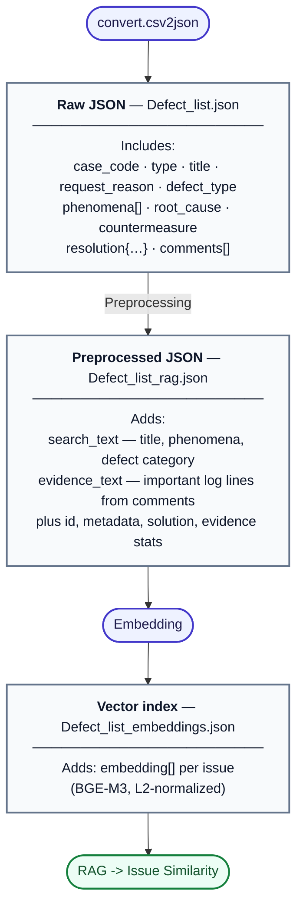

# Similar-issue pipeline

Data flow from CSV export through JSON stages to vector similarity search.

Render in any Mermaid-capable viewer, or export PNG/SVG from [Mermaid Live Editor](https://mermaid.live/).

**Note:** `search_text` is built from title, observed symptoms, and defect category (`json2jsonRAG`); `evidence_text` uses filtered lines from the comment thread.
