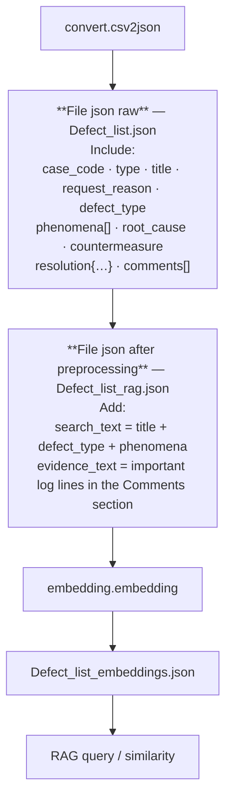

# Đánh giá RAG — truy xuất issue tương tự

Tài liệu này mô tả cách xuất batch kết quả retrieval để **đánh giá RAG** theo hai kênh: **AI tự chấm** và **người (Dev) chấm**.

## 1. Bối cảnh pipeline

Luồng dữ liệu từ **JSON raw** sang **JSON sau tiền xử lý** (rồi embed và truy vấn):



**Ghi chú khớp code (`src/convert/json2jsonRAG.py`):**

- **`search_text`** không phải một chuỗi nối thô mà được format thành các khối *Issue Title*, *Observed Symptoms* (từ `phenomena[]`), *Defect Category* (từ `defect_type`) — về mặt nội dung tương đương công thức *title + defect_type + phenomena*.
- **`evidence_text`** lấy từ `comments[]`: giữ các dòng có tín hiệu lỗi (regex) hoặc khớp từ khóa module (OMA, SKMSAgent, SEM, SKPM, …), tối đa `MAX_EVIDENCE_LINES` dòng, prefix `Technical Evidence:`.

Thứ tự xử lý đầy đủ (thư mục `phase1/find-similar-issues`):

1. `convert.csv2json` — CSV → `data/719/Defect_list.json` (**file json raw** ở trên).
2. `convert.json2jsonRAG` — thêm `search_text`, `evidence_text`, … → `Defect_list_rag.json` (**file sau preprocessing**).
3. `embedding.embedding` — embed bằng BGE-M3 → `Defect_list_embeddings.json`.
4. Truy vấn: embedding query × ma trận vector corpus, **cosine similarity** (vector đã chuẩn hóa → tích vô hướng).

Cấu hình đường dẫn model và file dữ liệu: `src/_config/setting.py`.

Demo một query: `python -m rag.rag_demo` (chạy từ thư mục `src`).

## 2. Tiêu chí “issue giống nhau” (để chấm điểm)

Khi đánh giá retrieval, **giống** được hiểu là:

- **Problem**: cùng bản chất vấn đề (triệu chứng / ngữ cảnh kỹ thuật tương đồng).
- **Solution direction**: cùng **hướng** xử lý (gợi ý fix / root cause và countermeasure **cùng pha** hoặc có thể áp dụng tương tự), không nhất thiết copy nguyên văn.

Các ô chấm trong file JSON xuất ra được thiết kế tách hai mặt này (`problem_match`, `solution_direction_match`) cộng `overall_score`.

## 3. Xuất batch phục vụ đánh giá

**Module:** `src/rag/rag_eval_export.py`

**Vai trò:** chọn ngẫu nhiên **N issue** trong `Defect_list.json`, với mỗi issue làm **query**, truy xuất **top-k** issue gần nhất trong corpus, ghi ra **một file JSON** có đủ ngữ cảnh để AI và Dev chấm ở bước sau.

### 3.1. Cách chạy

Từ thư mục `src`:

```powershell
cd D:\Projects\AITOPIA\phase1\find-similar-issues\src
python -m rag.rag_eval_export
```

### 3.2. Tham số dòng lệnh

| Tham số | Mặc định | Mô tả |
|--------|----------|--------|
| `--seed` | `42` | Seed random để tái lập cùng bộ issue khi cần so sánh lại run. |
| `--sample-size` | `50` | Số issue được chọn ngẫu nhiên làm query. |
| `--top-k` | `4` | Số kết quả retrieval cho mỗi query. |
| `--output` | *(xem dưới)* | Đường dẫn file JSON đầu ra. |
| `--search-max-chars` | `2000` | Giới hạn độ dài `search_text` trong snapshot mỗi hit. |
| `--evidence-max-chars` | `1500` | Giới hạn độ dài `evidence_text` trong snapshot mỗi hit. |

Nếu không truyền `--output`, file mặc định là:

`data/719/rag_eval_batch.json`  
(cùng thư mục với `Defect_list.json`, đường dẫn tuyệt đối phụ thuộc `FILE_JSON` trong `setting.py`).

### 3.3. Text dùng để embed query

Phải **khớp** logic indexing và `rag_demo`: ghép `search_text` + `evidence_text` từ bản ghi tương ứng trong `Defect_list_rag.json` (theo `case_code` / `id`).

### 3.4. Loại trừ chính issue khỏi kết quả

`meta.exclude_query_id_from_hits` = `true`: vector của **chính issue đang làm query** bị loại khỏi xếp hạng (tránh top-1 luôn là bản thân nó), phù hợp đánh giá “issue khác có giống không”.

## 4. Cấu trúc file JSON đầu ra (tóm tắt)

### 4.1. `meta`

- Thời gian tạo (UTC), `random_seed`, số query yêu cầu / số query thực xuất, `top_k`, model, thiết bị (`cpu`/`cuda`), đường dẫn các file nguồn, cấu hình truncation.

### 4.2. `queries[]` — mỗi phần tử

| Trường | Ý nghĩa |
|--------|---------|
| `query_index` | Chỉ số thứ tự trong mảng `queries` (0-based). |
| `source_row_index_in_defect_list_json` | Chỉ số dòng tương ứng trong mảng gốc `Defect_list.json`. |
| `query.snapshot` | Ngữ cảnh từ `Defect_list.json`: `case_code`, `type`, `title`, `phenomena`, `root_cause`, `countermeasure`, … |
| `query.query_text_char_length` | Độ dài chuỗi đã embed (kiểm tra độ dài query). |
| `retrieval[]` | Danh sách hit: `rank`, `case_code`, `similarity_score`, `snapshot` (text rút gọn + `root_cause`/`countermeasure` từ RAG). |
| `evaluation.criteria_hint` | Gợi ý tiêu chí (problem vs solution direction). |
| `evaluation.ai` | Khung để **AI** điền sau. |
| `evaluation.human` | Khung để **Dev** điền sau. |

Mỗi `evaluation.ai` / `evaluation.human` gồm:

- `filled`: ban đầu `false`; đổi thành `true` khi đã chấm xong.
- `per_hit[]`: mỗi dòng tương ứng một `rank`; đã có sẵn `case_code`, các ô `problem_match`, `solution_direction_match`, `overall_score`, `comment` (ban đầu `null`).
- `query_notes`: ghi chú cấp toàn query (tùy chọn).

Định dạng giá trị cho `problem_match` / `solution_direction_match` (boolean, 0–1, hay thang Likert) có thể **thống nhất trong team** khi triển khai bước chấm; file JSON chỉ cung cấp khung.

## 5. Bước sau: AI chấm và người chấm

1. **AI tự chấm:** đọc `query` + từng phần tử `retrieval[].snapshot`, điền `evaluation.ai` (theo prompt/thang điểm thống nhất).
2. **Dev chấm:** cùng dữ liệu, điền `evaluation.human` độc lập; có thể dùng để tính **tương quan** hoặc **accuracy** so với AI hoặc so với nhãn vàng (nếu có).

Có thể merge hai nhánh vào một báo cáo (CSV/BI) bằng script riêng; không bắt buộc nằm trong repo này.

### 5.1. Chấm tự động (proxy) và file phục vụ thống kê

**Module:** `src/rag/fill_ai_evaluation.py`

- Ghi đè (in-place) `evaluation.ai` trong file batch JSON: điền `problem_match`, `solution_direction_match` (thang **0–2**), `overall_score` (trung bình hai chiều: 0.0, 0.5, 1.0, 1.5, 2.0), `score_problem` / `score_solution` (điểm thô 0–1), `query_case_code`, `comment`.
- **Mặc định:** `lexical_difflib` — `SequenceMatcher` trên text problem (title/symptom/…) so với hit, và trên cặp root_cause+countermeasure; **không cần GPU**, ổn định. Ngưỡng tách band dùng `--lex-mid` / `--lex-hi` (mặc định 0.22 / 0.42) vì tỉ lệ ký tự trên chuỗi dài thường thấp hơn cosine embedding.
- **Tùy chọn:** `--use-embedding` dùng BGE-M3 cosine giống hệ retrieval; nặng hơn, cần đủ RAM; ngưỡng `--mid` / `--hi` (mặc định 0.52 / 0.72) phù hợp cosine.

```powershell
python -m rag.fill_ai_evaluation --input data\719\rag_eval_batch_cursor_composer2.json
```

**Xuất CSV (một dòng / một hit):** `src/rag/export_ai_eval_csv.py`

```powershell
python -m rag.export_ai_eval_csv data\719\rag_eval_batch_cursor_composer2.json
```

Tạo file cùng tên với đuôi `.csv` (UTF-8 BOM, mở tốt trong Excel). Cột gồm `query_index`, `query_case_code`, `rank`, `hit_case_code`, các điểm và `comment` — dùng trực tiếp cho **trung bình, histogram, pivot** theo `rank` hoặc theo query.

`meta.ai_evaluation` trong JSON ghi lại engine, ngưỡng và danh sách cột gợi ý cho báo cáo.

**Lưu ý:** điểm tự động là **proxy** để lượng hóa nhanh; khi so sánh với Dev nên coi nhãn con người là chuẩn chính.

## 6. File liên quan

| File | Vai trò |
|------|---------|
| `src/_config/setting.py` | Đường dẫn CSV/JSON, model, `TOP_K` cho demo, v.v. |
| `src/rag/rag_demo.py` | Demo một query (theo `ISSUE_TEST_NO`). |
| `src/rag/rag_eval_export.py` | Xuất batch JSON đánh giá. |
| `data/719/Defect_list.json` | Nguồn issue gốc; dùng để random sample query. |
| `data/719/Defect_list_rag.json` | Text đầy đủ cho query + snapshot hit. |
| `data/719/Defect_list_embeddings.json` | Corpus vector. |
| `data/719/rag_eval_batch.json` | *(mặc định)* kết quả xuất đánh giá. |
| `src/rag/fill_ai_evaluation.py` | Điền `evaluation.ai` (lexical hoặc embedding). |
| `src/rag/export_ai_eval_csv.py` | Flatten `evaluation.ai` → CSV thống kê. |
| `src/rag/stats_rag_eval.py` | Đọc batch JSON → báo cáo Markdown (`*_stats.md`). |
| `data/719/rag_eval_batch_cursor_composer2.json` | Ví dụ batch + AI đã chấm proxy. |
| `data/719/rag_eval_batch_cursor_composer2.csv` | Bản phẳng tương ứng (Excel). |

---

*Tài liệu phản ánh pipeline và script tại thời điểm tạo; nếu đổi `build_query_text` hoặc đường dẫn trong `setting.py`, cần cập nhật đồng bộ `rag_demo` và `rag_eval_export`.*
